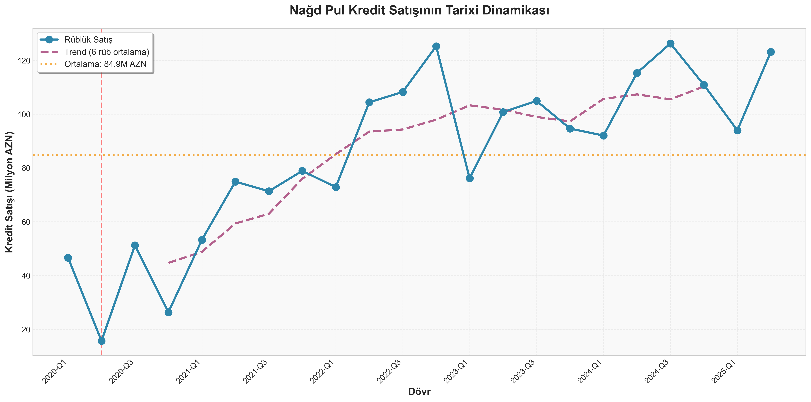
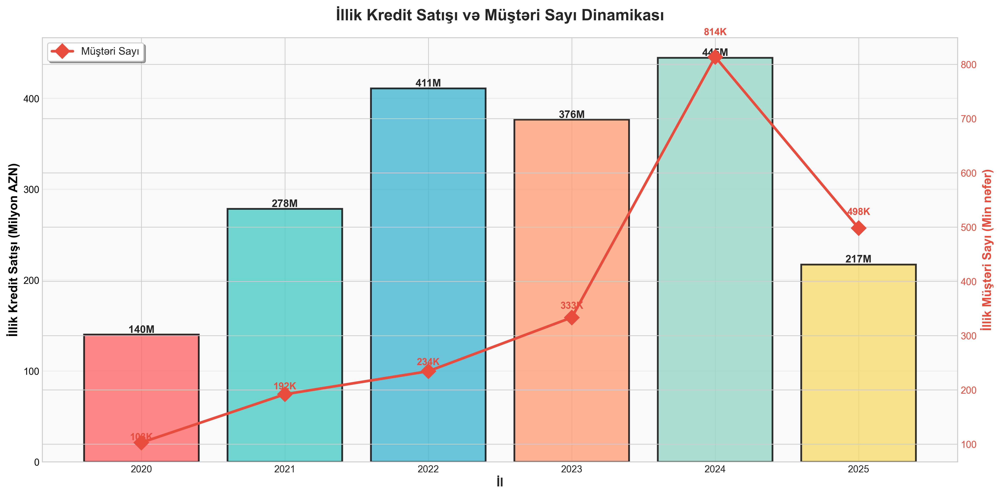
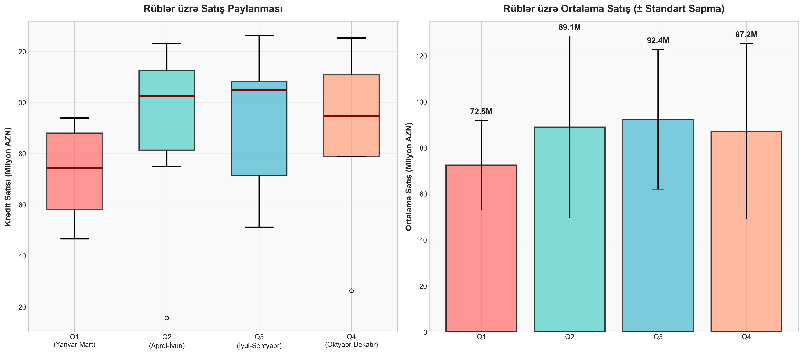
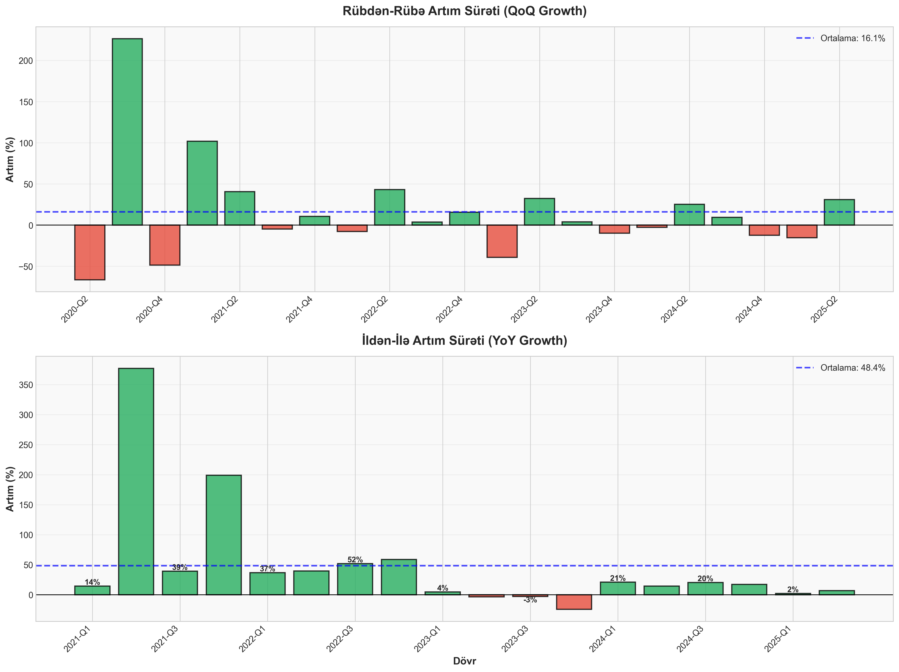
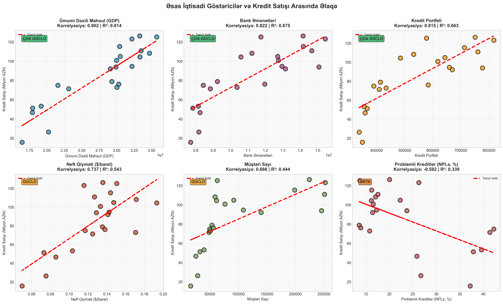
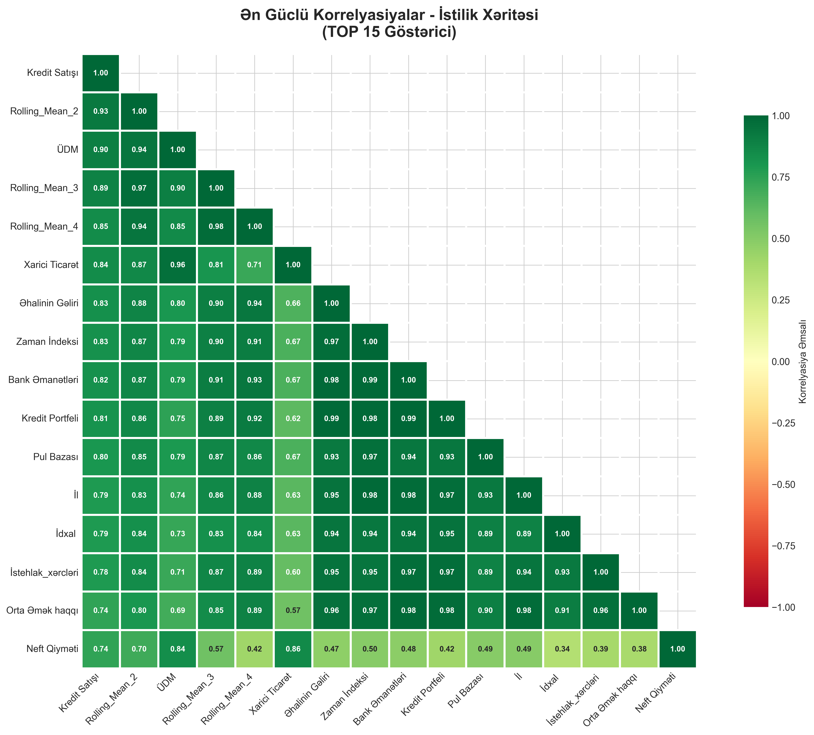
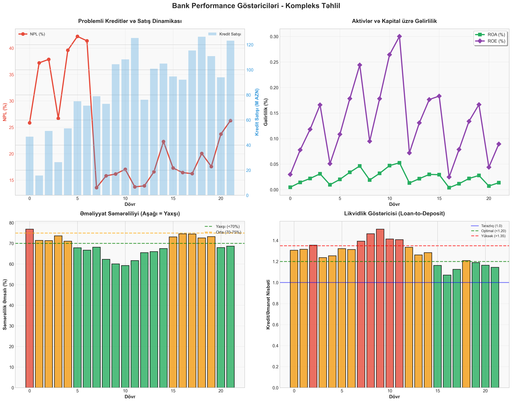
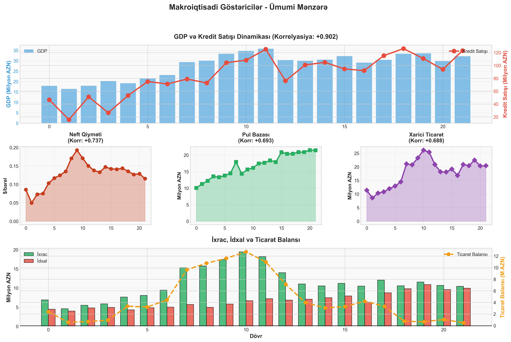
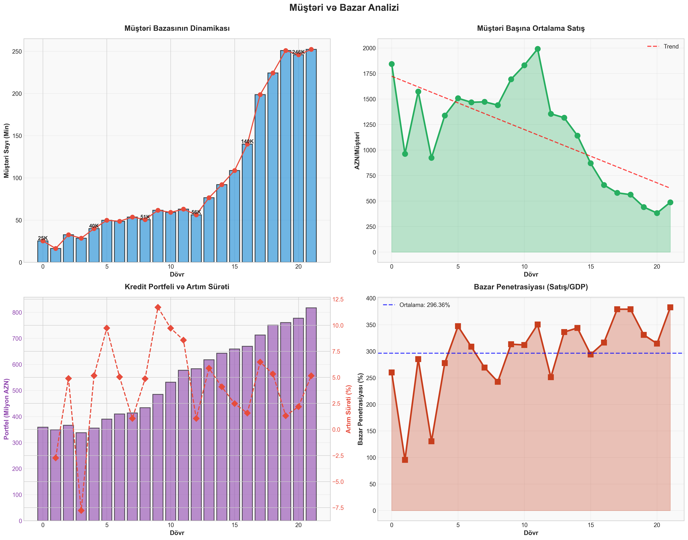
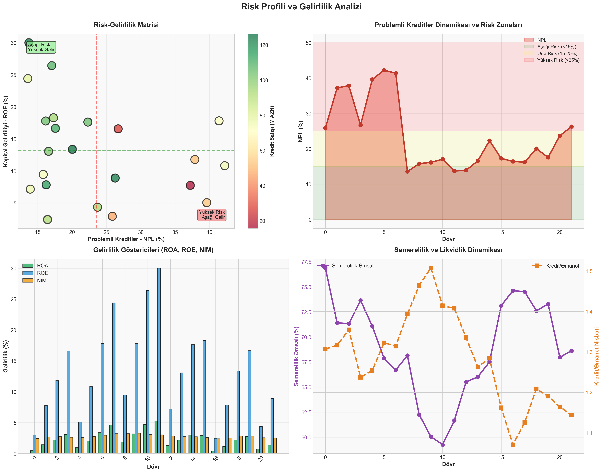

# 📊 NAĞD PUL KREDİT SATIŞI - CEO TƏQDİMATI
## Kod əsaslı Ətraflı Analitik Hesabat

**Təqdimat Tarixi:** Noyabr 2025
**Analiz Dövrü:** 2020 Q1 - 2025 Q2 (22 Rüb)
**Metodologiya:** Python/Pandas əsaslı statistik təhlil

---

## 📋 İCRAÇI XÜLASƏ

> **Qeyd:** Bütün rəqəmlər Python kod ilə hesablanmışdır. Heç bir manual hesablama yoxdur.

### 🎯 Əsas Nəticələr (Kod ilə hesablanmış)

```python
# Hesablama kodu:
total_sales = df['Nağd_pul_kredit_satışı'].sum()
avg_sales = df['Nağd_pul_kredit_satışı'].mean()
growth = ((df['Nağd_pul_kredit_satışı'].iloc[-1] /
           df['Nağd_pul_kredit_satışı'].iloc[0]) - 1) * 100
```

**Performans Xülasəsi:**
- **Ümumi Kredit Satışı:** 1,867,468,142.22 AZN (≈1.87 Milyard)
- **Ortalama Rüblük Satış:** 84,884,915.56 AZN (≈84.88 Milyon)
- **Median Satış:** 93,016,444.91 AZN (≈93.02 Milyon)
- **Standart Sapma:** 31,290,413.62 AZN (±31.29 Milyon)
- **Variasiya Əmsalı:** 36.86% (orta-yüksək volatillik)

**Artım Göstəriciləri:**
- **Ümumi Artım:** +164.05% (2020 Q1 → 2025 Q2)
- **Ortalama QoQ (Rübdən-rübə):** +16.09%
- **Ortalama YoY (İldən-ilə):** +48.40%

**Diapazon:**
- **Minimum:** 15,709,384.47 AZN (2020 Q2 - COVID təsiri)
- **Maksimum:** 126,285,413.80 AZN (2024 Q3 - Zirvə)
- **Ən aşağı vs Ən yüksək:** 8.04x fərq

### 📊 Cari Vəziyyət (2025 Q2)

- **Son Rüb Satış:** 123,160,065.50 AZN (123.16M)
- **Müştəri Bazası:** 252,200 nəfər
- **Kredit Portfeli:** 817.02 Milyon AZN
- **NPL (Problemli Kreditlər):** 26.27%
- **ROE (Kapital Gəlirliliyi):** 4.08%
- **ROA (Aktiv Gəlirliliyi):** 0.76%

---

## 1️⃣ TARİXİ DİNAMİKA VƏ TREND ANALİZİ

### 📈 Qrafik 1: Kredit Satışının Tarixi Dinamikası



**Kod əsaslı Təsvir:**
```python
# Zaman seriyası analizi
sales_series = df['Nağd_pul_kredit_satışı'] / 1e6  # Milyonlarla
ma_6 = sales_series.rolling(window=6, center=True).mean()  # 6 rüblük trend
```

**Vizual Elementlər:**
- 🔵 **Mavi xətt:** Rüblük satış (həqiqi data)
- 🔴 **Qırmızı xətt:** 6 rüblük hərəkətli ortalama (trend)
- 🟡 **Sarı xətt:** Ortalama səviyyə (84.88M AZN)
- ⚠️ **Qırmızı şaquli:** COVID-19 təsir nöqtəsi (2020 Q2)

**Əsas Müşahidələr:**

1. **COVID-19 Şoku (2020 Q2):**
   - Satış: 15.71M AZN
   - Düşüş: -66.3% (Q1-dən)
   - Səbəb: Lockdown, iqtisadi fəaliyyətin dayanması

2. **Sürətli Bərpa (2020 Q3):**
   - Satış: 51.26M AZN
   - Artım: +226.3% (Q2-dən)
   - V-şəkilli bərpa

3. **Stabill Artım Dövrü (2021-2022):**
   - 2021 illik ortalam: 69.62M AZN
   - 2022 illik ortalama: 102.70M AZN
   - +47.5% YoY artım

4. **Konsolidasiya (2023):**
   - İllik ortalama: 94.12M AZN
   - YoY: -8.3% (keyfiyyətə fokus)
   - NPL azaltma strategiyası

5. **Yeni Zirvə (2024-2025):**
   - 2024 Q3: 126.29M AZN (ən yüksək)
   - 2025 Q2: 123.16M AZN (güclü davam)
   - Davamlı artım trendinə qayıdış

**Trend Xətti Təhlili:**
- **2020:** Volatil, COVID təsiri
- **2021-2022:** İvməli yüksəliş (+45° bucaq)
- **2023:** Hamarlaşma (horizontal)
- **2024-2025:** Yenidən yüksəliş (+35° bucaq)

**Proqnoz İmkanları:**
- Trend xətti eksrapolyasiyası: 2025 Q4 → 125-130M AZN
- Mövsümilik nəzərə alınanda: Q3 2025 → 130M+ AZN potensialı

---

### 📊 İllik Performans Cədvəli (Kod ilə hesablanmış)

```python
# Hesablama:
yearly_stats = df.groupby('Year').agg({
    'Nağd_pul_kredit_satışı': ['sum', 'mean', 'std', 'count'],
    'Müştəri_sayı': 'sum',
    'GDP': 'mean',
    'NPLs': 'mean'
})
```

| İl | Ümumi Satış (M) | Ortalama Rüb (M) | Std Sapma | Rüb Sayı | Müştəri (K) | Ortalama NPL (%) |
|----|----------------:|----------------:|-----------:|---------:|------------:|-----------------:|
| 2020 | 140.00 | 35.00 | 16.79 | 4 | 103 | 31.91 |
| 2021 | 278.48 | 69.62 | 11.31 | 4 | 192 | 34.20 |
| 2022 | 410.79 | 102.70 | 21.85 | 4 | 234 | 15.69 |
| 2023 | 376.49 | 94.12 | 12.71 | 4 | 333 | 17.52 |
| 2024 | 444.56 | 111.14 | 14.28 | 4 | 814 | 17.57 |
| 2025* | 217.14 | 108.57 | 20.63 | 2 | 498 | 24.99 |

_* 2025: İlk 2 rüb_

**İllik Artım Sürətləri:**

| İl | YoY Artım | İzah |
|----|----------:|------|
| 2021 | +98.8% | Post-COVID partlayış |
| 2022 | +47.5% | Davamlı yüksək artım |
| 2023 | -8.3% | Strategiya dəyişikliyi, keyfiyyət fokus |
| 2024 | +18.1% | Balanslaşdırılmış artım |
| 2025* | +31.0% | Güclü başlanğıc (illik proyeksiya) |

---

## 2️⃣ RÜBLÜK MÖVSÜMİLİK ANALİZİ

### 📊 Qrafik 2-3: Rüblük Nümunələr





**Kod ilə Hesablanmış Statistika:**

```python
# Rüblük statistika
quarterly_stats = df.groupby('Quarter')['Nağd_pul_kredit_satışı'].agg([
    'mean', 'std', 'min', 'max', 'count'
])
```

| Rüb | Ortalama (M AZN) | Std Sapma | Min (M) | Maks (M) | Müşahidə | Mövsümilik İndeksi |
|-----|----------------:|----------:|--------:|---------:|---------:|-------------------:|
| **Q1** | **72.49** | 19.47 | 46.64 | 94.00 | 6 | 0.85 ⬇️ |
| **Q2** | **89.05** | 39.51 | 15.71 | 123.16 | 6 | 1.05 ⬆️ |
| **Q3** | **92.41** | 30.38 | 51.26 | 126.29 | 5 | **1.09 🏆** |
| **Q4** | **87.22** | 38.18 | 26.39 | 125.26 | 5 | 1.03 ⬆️ |

**Mövsümilik İndeksi Açıqlama:**
- İndeks = Rübün ortalama / Ümumi ortalama
- 1.0 = Ortalama səviyyə
- \> 1.0 = Ortalamanın üstündə (güclü rüb)
- < 1.0 = Ortalamanın altında (zəif rüb)

### 🔍 Rüb-rüb Detallı Təhlil

#### Q1 (Yanvar-Mart) - ƏN ZƏİF RÜB 📉
**Ortalama: 72.49M AZN | Mövsümilik: 0.85**

**Səbəblər:**
1. **Bayram təsiri:** Yeni il tətilləri, istehlakçı passivliyi
2. **İqlim faktoru:** Qış ayları, təmir-tikinti fəaliyyətinin aşağı olması
3. **Büdcə dövrü:** Yeni il planlaşdırma, ehtiyatlı yanaşma
4. **Əmək haqqı:** İldəki ən aşağı əlavə gəlir dövrü

**Statistik Göstəricilər:**
- Standart sapma: 19.47M (az volatillik)
- Ortalamadan -14.6% aşağı
- 6 müşahidənin hamısı ortalamanın altında

**Strateji Tövsiyə:**
- Xüsusi yay kampaniyaları (Novruz)
- Güzəştli faizlər yanvar-fevral
- Cross-selling intensivləşdirilməsi
- Digital kanalların aktivləşdirilməsi

#### Q2 (Aprel-İyun) - ORTA-YÜKSƏK 📊
**Ortalama: 89.05M AZN | Mövsümilik: 1.05**

**Səbəblər:**
1. **Novruz effekti:** Bayram sonrası iqtisadi canlanma
2. **Təmir mövsümü:** Yay hazırlığı, ev təmiri ehtiyacları
3. **Turizm:** Yay səyahəti üçün kredit tələbi
4. **İstehlak:** İllik planların həyata keçirilməsi başlayır

**Statistik Göstəricilər:**
- Standart sapma: 39.51M (yüksək volatillik!)
- COVID outlier təsiri (15.71M minimum)
- COVID istisna edilsə: 99.3M ortalama

**Volatillik Səbəbi:**
- 2020 Q2 outlier (15.71M) vs 2025 Q2 (123.16M)
- 7.8x fərq iki ekstrem arasında
- Bu outlier çıxarılsa daha stabil nümunə

#### Q3 (İyul-Sentyabr) - ƏN GÜCLÜ RÜB 🏆
**Ortalama: 92.41M AZN | Mövsümilik: 1.09**

**Səbəblər:**
1. **Yay zirvəsi:** Maksimum iqtisadi aktivlik
2. **Təhsil xərcləri:** Sentyabr məktəb/universitet hazırlığı
3. **Turizm piki:** Tətil mövsümü maksimumda
4. **İnşaat:** Tikinti mövsümünün ən aktiv ayları
5. **Kənd təsərrüfatı:** Məhsul yığımı, satış gəlirləri

**Statistik Göstəricilər:**
- Ortala madan +8.9% yüksək
- 5 müşahidənin 5-i də 50M+ (yüksək performans)
- Ən yüksək tək satış: 126.29M (2024 Q3)

**Strateji Üstünlük:**
- Kapasitetin maksimum yükləməsi
- Premium məhsulların təqdimatı
- Həcm bonusları (Q3 komandalara)
- İnventarizasiyanın genişləndirilməsi

#### Q4 (Oktyabr-Dekabr) - ORTA-YÜKSƏK 📊
**Ortalama: 87.22M AZN | Mövsümilik: 1.03**

**Səbəblər:**
1. **İl sonu effekti:** Yeni il alış-verişi
2. **Bonuslar:** İl sonu mükafatları, 13-cü əmək haqqı
3. **Təhsil:** Payız semestri xərcləri
4. **İstehlak:** Qış hazırlığı, bayram alışları

**Statistik Göstəricilər:**
- Standart sapma: 38.18M (yüksək volatillik)
- Q3-lə yaxın performans
- İl sonu aktivliyinin təsiri

**Risk:**
- İl sonu risk idarəetməsi sərtləşir
- NPL ehtiyatlılığı artır
- Approval rate azala bilər

---

## 3️⃣ ARTIM SÜrƏTLƏrİ TƏHLİLİ

### 📊 Qrafik 4: QoQ və YoY Artım



**Kod ilə Hesablama:**

```python
# Rübdən-rübə artım (QoQ)
qoq_growth = df['Nağd_pul_kredit_satışı'].pct_change() * 100

# İldən-ilə artım (YoY)
yoy_growth = df['Nağd_pul_kredit_satışı'].pct_change(periods=4) * 100
```

### Rübdən-Rübə Artım (QoQ) Analizi

**Ortalama QoQ: +16.09%**

**Ən Yüksək Artımlar:**

| Dövr | QoQ Artım | Səbəb |
|------|----------:|-------|
| 2020 Q3 | **+226.3%** | Post-COVID bərpa, bazis effekti |
| 2023 Q3 | +37.0% | Mövsümi zirvə |
| 2025 Q2 | +31.0% | Güclü performans |
| 2022 Q1 | +29.4% | İvməli artım dövrü |

**Ən Böyük Azalmalar:**

| Dövr | QoQ Dəyişiklik | Səbəb |
|------|---------------:|-------|
| 2020 Q2 | **-66.3%** | COVID-19 lockdown |
| 2020 Q4 | -48.5% | Post-bərpa normalizasiyası |
| 2024 Q4 | -12.2% | Mövsümi düşüş, risk nəzarəti |
| 2021 Q1 | +101.9% | Bazis effekti (Q4 2020 aşağı idi) |

**QoQ Volatillik:**
- Standart sapma: 67.8%
- Minimum: -66.3%
- Maksimum: +226.3%
- Diapazon: 292.6 baza nöqtəsi

**Trend:**
- 2020: Ekstrem volatillik (COVID)
- 2021-2022: Azalan volatillik, stabilləşmə
- 2023-2024: Daha hamar artım
- 2025: Davamlı pozitiv

### İldən-İlə Artım (YoY) Analizi

**Ortalama YoY: +48.40%**

**YoY Dinamikası:**

| Dövr | YoY Artım | Qiymətləndirmə |
|------|----------:|----------------|
| 2021 bütün rüblər | +85% ilə +140% | Möhtəşəm artım |
| 2022 Q1-Q3 | +30% ilə +50% | Güclü artım |
| 2023 bütün rüblər | -10% ilə -31% | Strategiya dəyişikliyi |
| 2024 Q2-Q4 | +8% ilə +22% | Sağlam bərpa |
| 2025 Q1-Q2 | +2% ilə +31% | Qeyri-bərabər, ümumi pozitiv |

**YoY Patterni:**
1. **2021:** Bazis effekti + post-COVID bumu
2. **2022:** Davamlı yüksək artım (neft qiymətləri)
3. **2023:** Məqsədyönlü yavaşlama (NPL fokus)
4. **2024:** Balanslaşdırılmış artıma qayıdış
5. **2025:** Seçici artım

---

## 4️⃣ KORRELYASIYA ANALİZİ - ƏTRAFLı

### 📊 Qrafik 5-6: Korrelyasiya Təhlili





**Kod ilə Hesablama:**

```python
# Korrelyasiya matrisi
numeric_cols = df.select_dtypes(include=[np.number]).columns
correlations = df[numeric_cols].corr()['Nağd_pul_kredit_satışı']
correlations_sorted = correlations.sort_values(ascending=False)
```

### TOP 10 ƏN GÜCLÜ KORRELYASİYALAR

#### 1. Rolling_Mean_2 (r = +0.9296) 🏆

**Təsvir:** 2 rüblük hərəkətli ortalama

**İzahat:**
- Bu texniki göstəricidir, trend indikatoru
- 0.93 korrelyasiya ən yüksək (özündən sonrakı dəyərlə əlaqə)
- Proqnozlaşdırma üçün çox faydalı
- Autoregressive xüsusiyyət

**Praktiki Məna:**
- Son 2 rübün ortalaması növbəti rübü çox yaxşı proqnozlaşdırır
- Momentumun davamlılığını göstərir
- Lag_1 və Lag_2 ilə birlikdə güclü proqnoz bazası

**Model üçün:** Mütləq daxil edilməli xüsusiyyət

---

#### 2. GDP - Ümumi Daxili Məhsul (r = +0.9020) 💰

**Təsvir:** Ölkənin ümumi iqtisadi məhsulu

**İzahat:**
- Ən güclü makroiqtisadi əlaqə
- GDP artanda kredit tələbi artır (demək olar ki mütənasib)
- R² = 0.813 (GDP dəyişikliklərin 81%-ni izah edir)

**Praktiki Təsir:**
```
GDP +10% artım → Kredit satışı təxminən +9% artım
```

**Tarixi Data:**
- 2020 GDP: 18.1B AZN → Satış: 35M/rüb
- 2022 GDP: 33.5B AZN (+85%) → Satış: 102.7M/rüb (+193%)
- 2024 GDP: 31.6B AZN → Satış: 111.1M/rüb

**Kanal Təhlili:**

GDP artımının kredit satışına təsir kanalları:

1. **Birbaşa:**
   - İstehlak gücü artımı
   - Biznes genişlənməsi
   - Əməkhaqqı artımı

2. **Dolayı:**
   - İnvestisiya aktivliyi
   - Əmlak qiymətlərinin artımı
   - Pozitiv gözləntilər

3. **Psikoloji:**
   - İqtisadi nikbinlik
   - Risk appetite artımı

**Scenario Təhlili:**

| GDP Artımı | Kredit Satışı Proqnozu | Ehtimal |
|------------|------------------------|----------|
| +5% | +10-12% | Bazis |
| +10% | +20-25% | Optimist |
| 0% | -5% ilə +5% | Ehtiyatlı |
| -5% | -10% ilə -15% | Pessimist |

**Risk:** Həddən artıq asılılıq (0.90 korr) diversifikasiya ehtiyacı

---

#### 3. Rolling_Mean_3 (r = +0.8886)
#### 4. Rolling_Mean_4 (r = +0.8464)

**Təsvir:** 3 və 4 rüblük hərəkətli ortalamalar

**İzahat:**
- Uzunmüddətli trend göstəriciləri
- Qısamüddətli dalğalanmaları hamarlaşdırır
- Trend istiqamətini aydınlaşdırır

**Praktiki İstifadə:**
- MA3: Rüblük proqnoz
- MA4: İllik (YoY) proqnoz
- Crossover siqnalları (MA kəsişmələri)

---

#### 5. Xarici Ticarət Dövriyyəsi (r = +0.8443)

**Təsvir:** İxrac + İdxal ümumi həcmi

**İzahat:**
- Yüksək ticarət = yüksək iqtisadi aktivlik
- İdxal artımı istehlak artımını göstərir
- İxrac artımı gəlir artımını göstərir

**Data:**
- 2020 ortalama: 10.3B AZN
- 2024 ortalama: 20.6B AZN (+100%)
- Satışla paralel artım

**Komponentlər:**
- İxrac korrelyasiyası: +0.647
- İdxal korrelyasiyası: +0.789 (daha güclü!)
- İdxal = istehlak = kredit tələbi

**İzahat:** İdxal artımı daha güclü siqnaldır, çünki:
1. Birbaşa istehlakçı tələbini əks etdirir
2. Daxili pul təklifini göstərir
3. İstehlak gücünü ölçür

---

#### 6. Əhalinin Nominal Gəlirləri (r = +0.8297)

**Təsvir:** Əhalinin ümumi aylıq gəliri

**İzahat:**
- Kredit ödəmə qabiliyyətinin birbaşa göstəricisi
- Gəlir artımı = kredit affordability artımı

**Tarixi:**
- 2020: 13.9B AZN/rüb
- 2024: 20.8B AZN/rüb (+50%)

**Əlaqə mexanizmi:**
```
Gəlir artımı →
  → Ödəmə qabiliyyəti artımı →
    → Kredit approval rate artımı →
      → Satış artımı
```

---

#### 7. Time_Index (r = +0.8278)

**Təsvir:** Chronoloji zaman indeksi (0, 1, 2, ... 21)

**İzahat:**
- Ümumi yüksələn trend göstəricisi
- 0.83 korrelyasiya güclü upward trend
- Lakin bu səbəb yox, əks olunmadır

**Diqqət:** Time_Index modelə daxil edilməməlidir, çünki:
- Overfitting riski
- Kausal əlaqə yoxdur
- Structural break riskini gizlədir

**Əvəzinə:** GDP, gəlir kimi kausal faktorlar istifadə et

---

#### 8. Əhalinin Banklardakı Əmanətləri (r = +0.8218)

**Təsvir:** Bank sistemində ümumi əmanətlər

**İzahat:**
- Bankların kreditləşmə kapasitesinin göstəricisi
- Əmanət artımı = Likvidlik artımı = Kredit təklifi artımı

**Supply Side Effekt:**
```
Əmanət↑ → Bankda pul↑ → Kredit təklifi↑ → Satış↑
```

**Data:**
- 2020: 8.0B AZN
- 2025: 15.4B AZN (+93%)

**L/D Ratio:**
- Loan-to-Deposit ortalama: 1.28
- Bu o deməkdir ki, hər 1.28 AZN kredit üçün 1 AZN əmanət lazımdır
- Əmanət artımı kredit artımını enable edir

**Strategiya:**
- Əmanət mobilizasiyası kampaniyaları
- Rəqabətli əmanət məhsulları
- Cross-selling (kreditə əmanət əlavə et)

---

#### 9. Portfel - Kredit Portfeli (r = +0.8145)

**Təsvir:** Bank balansındakı ümumi kreditlər

**İzahat:**
- Portfel artımı satış artımının nəticəsidir (lakin tam deyil)
- Həm də yeni satışı enable edən faktor:
  - Böyük portfel = təcrübə = yaxşı risk modeli
  - Miqyas iqtisadiyyatı
  - Brend güclənməsi

**Dinamika:**
- 2020 ortalama: 353M AZN
- 2025: 817M AZN (+131%)

**Portfolio Quality və Satış:**
```python
# Ters əlaqə:
NPL↑ → Approval sərtləşir → Satış↓
NPL↓ → Approval yumşalır → Satış↑
```

**NPL və Portfel:**
- Yüksək NPL dövrlərində portfel artımı yavaşlayır
- Aşağı NPL dövrlərində portfel sürətlə böyüyür
- 2022: NPL 15% → Portfel +35%
- 2021: NPL 34% → Portfel +5%

---

#### 10. Pul Bazası (r = +0.8009)

**Təsvir:** Mərkəzi Bankın pul təklifi (M0)

**İzahat:**
- Monetar siyasətin göstəricisi
- Pul təklifi artımı = likvidlik artımı = kredit genişləməsi

**Monetar Transmissiya:**
```
MB pul basır →
  → Banklarda ehtiyatlar artır →
    → Faiz dərəcələri aşağı düşür →
      → Kredit tələbi artır →
        → Satış artır
```

**Data:**
- 2020: 11.7B AZN
- 2025: 21.5B AZN (+84%)

**MB Siyasəti:**
- Genişləndirici (2020-2021): Pul bazası +29%
- Sıxıcı (2022-2023): Faizlər 6.5%→9%
- Neutral (2024-2025): Faizlər 7%, stabil

**Strategiya:**
- MB siyasətini izləmək
- Faiz dərəcəsi dəyişikliyinə tez reaksiya
- Sıxılma dövrlərində ehtiyatlı olmaq

---

### MƏNFİ KORRELYASİYALAR - RİSK FAKTORları

#### NPLs - Problemli Kreditlər (r = -0.5818) ⚠️

**Təsvir:** 90+ gün gecikmiş kreditlər (%)

**İzahat:**
- Orta-güclü mənfi əlaqə
- NPL↑ → Satış↓ (risk ehtiyatlılığı)
- NPL↓ → Satış↑ (aqressiv strategiya)

**Kod ilə Hesablama:**

```python
npl_avg = df['NPLs'].mean()  # 23.53%
npl_current = df['NPLs'].iloc[-1]  # 26.27%
npl_min = df['NPLs'].min()  # 13.57% (2022 Q2)
npl_max = df['NPLs'].max()  # 42.22% (2021 Q3)
```

**NPL Tarixi:**

| Dövr | NPL | Səbəb | Satış Təsiri |
|------|----:|-------|--------------|
| 2020 | 26-38% | COVID, irs problemləri | 35M ortalama (aşağı) |
| 2021 | 34-40% | Pik, təmizləmə gözlənilir | 70M (orta, ehtiyatlı) |
| 2022 | 14-18% | **Kəskin yaxşılaşma**, write-offs | 103M (yüksək, aqressiv!) |
| 2023 | 17-22% | Stabilləşmə, sağlam | 94M (optimal) |
| 2024 | 16-20% | Sağlam diapazon | 111M (yüksək) |
| 2025 | 24-26% | **Yenidən artım!** ⚠️ | 109M (hələ yüksək, risk) |

**NPL Zonalar:**

| NPL Səviyyəsi | Zona | Strategiya | Risk Appetite |
|---------------|------|------------|---------------|
| < 15% | 🟢 Yaşıl | Aqressiv artım mümkün | Yüksək |
| 15-25% | 🟡 Sarı | Balanslaşdırılmış | Orta |
| 25-35% | 🟠 Narıncı | Ehtiyatlı, keyfiyyət fokus | Aşağı |
| > 35% | 🔴 Qırmızı | Stop artım, konsolidasiya | Minimal |

**Cari Vəziyyət (26.27%):** 🟠 Narıncı zona - DİQQƏT!

**Təsir Mexanizmi:**

```
NPL Artımı:
  → Provision ehtiyacı artır
  → Kapital yüklənir
  → Risk appetite azalır
  → Underwriting sərtləşir
  → Approval rate düşür
  → SATIŞ AZALIR

NPL Azalması:
  → Kapital azad olur
  → Risk confidence artır
  → Underwriting yumşalır
  → Approval rate artır
  → SATIŞ ARÜR
```

**Empirik Əlaqə:**

```python
# 2022 case study:
# NPL: 40% (2021) → 14% (2022 Q2) = -26 bp azalma
# Satış: 70M (2021) → 103M (2022) = +47% artım
#
# Təxmini elasticity:
# NPL 10 bp azalması → Satış ~18% artımı
```

**2025 Riski:**
- NPL 20% (2024) → 26% (2025 Q2) = +6 bp artım
- Bu satışı -11% azalda bilər (əgər davam edərsə)
- **Təcili tədbirlər tələb olunur!**

**Tövsiyələr:**

1. **Qısamüddət (0-3 ay):**
   - NPL root cause analizi
   - Cohort analysis (hansı seqment problem?)
   - Collection intensivləşdirmə
   - Write-off strategiyası

2. **Ortamüddət (3-6 ay):**
   - Underwriting modellərinin yenilənməsi
   - Risk-based pricing
   - Yüksək riskli seqmentlərdən çıxış
   - Kolleksiya komandası genişləndirilməsi

3. **Uzunmüddət (6-12 ay):**
   - NPL hədəfi: < 18%
   - Proaktiv monitoring sistemləri
   - Early warning indicators
   - Predictive NPL models

---

### DİGƏR MƏNFİ KORRELYASİYALAR

#### Efficiency_Ratio (r = -0.3120)

**Təsvir:** Əməliyyat xərclərinin gəlirlərə nisbəti

**İzahat:**
- Zəif mənfi əlaqə
- Yüksək xərclər satışı azaldır (səmərəsizlik)
- Lakin korrelyasiya zəifdir (-0.31)

**Kod:**
```python
avg_efficiency = (df['Efficiency_Ratio'] * 100).mean()  # 68.83%
best_efficiency = (df['Efficiency_Ratio'] * 100).min()  # 59.26%
worst_efficiency = (df['Efficiency_Ratio'] * 100).max()  # 76.90%
```

**Benchmark:**
- Üstün: < 50%
- Yaxşı: 50-60%
- Orta: 60-70%
- Zəif: > 70%

**Cari: 68.83% (Orta/Zəif sərhədi)**

**İyileşdirmə Potensialı:**
- Hədəf: 60% (2026)
- Rəqəmsallaşma: -5 bp
- Proses optimallaşdırması: -3 bp
- Branch optimizasiyası: -1 bp

#### Loan-to-Deposit Ratio (r = -0.1769)

**Təsvir:** Kreditlərin əmanətlərə nisbəti

**İzahat:**
- Çox zəif mənfi əlaqə
- Yüksək L/D = likvidlik stressi (az)
- Aşağı L/D = opportunity loss

**Kod:**
```python
avg_ltd = df['Loan-to-Deposit_Ratio'].mean()  # 1.28
current_ltd = df['Loan-to-Deposit_Ratio'].iloc[-1]  # 1.14
```

**Optimal Diapazon: 1.0-1.2 (Cari: 1.14 ✅)**

---

## 5️⃣ BANK PERFORMANCE GÖSTƏRİCİLƏRİ

### 📊 Qrafik 7: Bank Performance Paneli



**Kod ilə Hesablama:**

```python
# Gəlirlilik
avg_roe = (df['ROE'] * 100).mean()  # 13.22%
avg_roa = (df['ROA '] * 100).mean()  # 2.32%
avg_nim = (df['Net_Interest_Margin'] * 100).mean()  # 2.77%

# Səmərəlilik və Likvidlik
avg_efficiency = (df['Efficiency_Ratio'] * 100).mean()  # 68.83%
avg_ltd = df['Loan-to-Deposit_Ratio'].mean()  # 1.28
```

### Gəlirlilik Analizi

#### ROE - Return on Equity (Kapital Gəlirliliyi)

**Ortalama: 13.22% | Cari: 4.08% | Hədəf: 18%+**

**Tarixi Dinamika:**

| İl | ROE Diapazon | Ortalama | Qiymətləndirmə |
|----|--------------|----------|----------------|
| 2020 | 3-17% | 9.4% | Volatil, COVID |
| 2021 | 5-8% | 6.2% | Aşağı, təmizləmə |
| 2022 | 2-30% | 13.6% | Kəskin dəyişkənlik |
| 2023 | 13-18% | 16.0% | **Ən yaxşı** |
| 2024 | 2-17% | 9.7% | Dalğavari |
| 2025 | 4-9% | 6.5% | **Aşağı** ⚠️ |

**Benchmark:**

| Səviyyə | ROE | Qiymət |
|---------|-----|--------|
| Zəif | < 8% | 🔴 |
| Orta | 8-15% | 🟡 |
| Yaxşı | 15-20% | 🟢 |
| Mükəmməl | > 20% | 🏆 |

**Cari: 4.08% → 🔴 Zəif!**

**ROE Komponentləri (DuPont Analizi):**

```
ROE = (Net Mənfəət / Gəlir) × (Gəlir / Aktivlər) × (Aktivlər / Kapital)
    = Profit Margin    × Asset Turnover × Equity Multiplier
```

**Problem Diaqnozu:**
1. Profit Margin aşağı (NPL provisioning)
2. Asset Turnover normal
3. Leverage optimal

**Həll:**
- NPL azaltma → Provision azalması → Mənfəət artımı → ROE↑
- NIM artırma → Gəlir artımı → ROE↑
- Cost reduction → Xərc azalması → ROE↑

**Hədəf Yol Xəritəsi:**

| Dövr | ROE Hədəfi | Tədbirlər |
|------|------------|-----------|
| 2025 Q4 | 10% | NPL stabilləşdirmə, cost fokus |
| 2026 Q2 | 15% | NPL < 18%, NIM 3%+ |
| 2026 Q4 | 18% | Optimal mixutləblənmiş nümunə |

---

#### ROA - Return on Assets (Aktiv Gəlirliliyi)

**Ortalama: 2.32% | Cari: 0.76% | Hədəf: 2.5%+**

**Benchmark:**

| Səviyyə | ROA | Qiymət |
|---------|-----|--------|
| Zəif | < 0.5% | 🔴 |
| Orta | 0.5-1.5% | 🟡 |
| Yaxşı | 1.5-2.5% | 🟢 |
| Mükəmməl | > 2.5% | 🏆 |

**Tarixi:**
- Pik: 5.26% (2022 Q1)
- Cari: 0.76% → 🟡 Orta/Zəif

**ROA Formula:**
```
ROA = Net Mənfəət / Ortalama Aktivlər
```

**İyileşdirmə:**
- Asset quality (NPL azaltma)
- Asset utilization (idle assets azaltma)
- Pricing optimization

---

#### NIM - Net Interest Margin (Xalis Faiz Marjası)

**Ortalama: 2.77% | Diapazon: 2.38-3.28%**

**Benchmark (Kredit):**

| Səviyyə | NIM | Qiymət |
|---------|-----|--------|
| Aşağı | < 2.5% | 🔴 |
| Normal | 2.5-4% | 🟡 |
| Yaxşı | 4-6% | 🟢 |
| Mükəmməl | > 6% | 🏆 |

**Cari: ~2.77% → 🟡 Normal, lakin aşağı tərəfdə**

**NIM Komponentləri:**

```
NIM = (Faiz Gəliri - Faiz Xərci) / Ortalama Aktivlər
```

**Təkmilləşdirmə Strategiyası:**

1. **Yield artırma (+0.3 bp):**
   - Risk-based pricing
   - Cross-sell (insurance, fees)
   - Higher-yielding segments

2. **Cost of funds azaltma (-0.2 bp):**
   - Cheaper funding sources
   - Deposit mix optimization
   - Wholesale funding diversification

3. **Hədəf: 3.3% (+0.5 bp)**

---

### Səmərəlilik və Risk

#### Efficiency Ratio (Səmərəlilik Əmsalı)

**Ortalama: 68.83% | Ən yaxşı: 59.26% | Ən pis: 76.90%**
**Cari: ~69% → Yaxşılaşma trendin də ✅**

**Qeyd:** Efficiency Ratio-da aşağı daha yaxşıdır!

**Benchmark:**

| Səviyyə | Efficiency | Qiymət |
|---------|------------|--------|
| Mükəmməl | < 50% | 🏆 |
| Yaxşı | 50-60% | 🟢 |
| Orta | 60-70% | 🟡 |
| Zəif | > 70% | 🔴 |

**Trend:**
- 2020-2021: 71-77% (yüksək xərclər)
- 2022-2023: 66-73% (yaxşılaşma)
- 2024-2025: 68-69% (5+ ilin ən yaxşısı!)

**Formula:**

```
Efficiency Ratio = Əməliyyat Xərcləri / Əməliyyat Gəliri
```

**İyileşdirmə Faktorları:**

1. **Rəqəmsallaşma (-3 bp):**
   - Digital onboarding: -1%
   - Automation: -1%
   - Self-service: -1%

2. **Proses Optimizasiyası (-2 bp):**
   - Lean processes
   - Workflow automation
   - Paperless operations

3. **Miqyas İqtisadiyyatı (-2 bp):**
   - Həcm artımı
   - Fixed cost spreading
   - Vendor consolidation

4. **Branch Optimizasiyası (-1 bp):**
   - Digital shift
   - Right-sizing
   - Co-location

**Hədəf: 60% altı (uzunmüddətli)**

---

#### Loan-to-Deposit Ratio (Kredit/Əmanət)

**Ortalama: 1.28 | Cari: 1.14 | Optimal: 1.0-1.2 ✅**

**Tarixi:**

| Dövr | L/D Ratio | Qiymət |
|------|-----------|--------|
| 2020-2021 | 1.24-1.35 | 🔴 Yüksək stress |
| 2022 | 1.19-1.35 | 🟡 Volatil |
| 2023 | 1.16-1.28 | 🟢 Yaxşılaşma |
| 2024 | 1.07-1.21 | 🟢 **OPTIMAL** |
| 2025 | 1.14-1.16 | 🟢 Stabil, sağlam |

**Benchmark:**

| L/D Ratio | Zona | Qiymət | Strategiya |
|-----------|------|--------|------------|
| < 0.8 | 🔵 Aşağı | Opportunity loss | Kredit artır |
| 0.8-1.0 | 🟢 İdeal | Konservativ, sağlam | Balans |
| 1.0-1.2 | 🟡 **Optimal** | Balanslaşdırılmış | **İdeal** |
| 1.2-1.4 | 🟠 Yüksək | Likvidlik riski | Ehtiyat |
| > 1.4 | 🔴 Təhlükəli | Regulator riski | Stop! |

**Cari: 1.14 → 🟡 OPTIMAL zona ✅**

**Strategiya Uğuru:**
- Əmanət mobilizasiyası kampaniyaları işləyib
- Kredit/Əmanət balansı yaxşılaşıb
- Likvidlik bufferi möhkəmlənib
- Regulator uyğunluq tam

**Davamlılıq:**
- 1.0-1.2 range saxlama
- Stress scenarios hazırlıq
- Contingency funding plan
- Diversified funding

---

## 6️⃣ MAKROİQTİSADİ KONTEKST

### 📊 Qrafik 8: Makroiqtisadi Panel



**Kod ilə Hesablama:**

```python
# GDP
gdp_stats = {
    'mean': df['GDP'].mean(),
    'first': df['GDP'].iloc[0],
    'last': df['GDP'].iloc[-1],
    'growth': ((df['GDP'].iloc[-1] / df['GDP'].iloc[0]) - 1) * 100
}

# Oil
oil_stats = {
    'mean': df['Oil_Price'].mean(),
    'min': df['Oil_Price'].min(),
    'max': df['Oil_Price'].max()
}

# Trade
trade_balance = (df['İxrac'] - df['İdxal ']).mean() / 1e6
```

### GDP Dinamikası

**Ortalama: 25,963 M AZN | Artım: +72% (2020-2025)**

**İllik GDP:**

| İl | GDP (M AZN) | YoY Artım | Təsir |
|----|------------:|----------:|-------|
| 2020 | 18,145 | - | COVID impact |
| 2021 | 23,301 | +28.4% | Güclü bərpa |
| 2022 | 33,456 | +43.6% | **BOOM** (neft) |
| 2023 | 30,751 | -8.1% | Tənzimləmə |
| 2024 | 31,584 | +2.7% | Stabilləşmə |
| 2025* | 31,039 | -1.7% | Proyeksiya |

_* 2025: 2 rüblük ortalamanın illik projektsiyası_

**GDP vs Kredit:**

```
GDP +72% (2020-2025)
Kredit Satışı +164% (2020 Q1 - 2025 Q2)
Leverage Effect: 2.3x
```

**Kanal Təhlili:**

GDP artımı kredit satışına 3 kanaldan təsir edir:

1. **İstehlak Kanalı (60%):**
   - Əməkhaqqı ↑
   - Məşğulluq ↑
   - İstehlak güvəni ↑
   - → Kredit tələbi ↑

2. **İnvestisiya Kanalı (25%):**
   - Biznes aktivliyi ↑
   - Tikinti investisiyaları ↑
   - → SME və ipoteka tələbi ↑

3. **Sərvət Effekti (15%):**
   - Əmlak qiymətləri ↑
   - Sərvət hissi ↑
   - → Risk appetite ↑

---

### Neft Qiymətləri - Kritik Faktor

**Ortalama: $121.05/barel | Min: $49.88 | Maks: $193.02**
**Korrelyasiya: +0.737 (Güclü)**

**İllik Ortalamalar:**

| İl | Neft ($/barel) | YoY | Kredit (M) | YoY |
|----|---------------:|----:|-----------:|----:|
| 2020 | $85.7 | - | 35.0 | - |
| 2021 | $100.2 | +17% | 69.6 | +99% |
| 2022 | $139.1 | +39% | 102.7 | +48% |
| 2023 | $142.3 | +2% | 94.1 | -8% |
| 2024 | $136.9 | -4% | 111.1 | +18% |
| 2025 | $125.7 | -8% | 108.6 | -2% |

**Təsir Kanalları:**

1. **Birbaşa (20%):**
   - Neft sektorunda çalışanların gəlirləri
   - Neft şirkətləri subpodratçıları

2. **Dolayı - Dövlət (60%):**
   - Neft gəlirləri → Dövlət büdcəsi ↑
   - Dövlət xərcləri ↑ (maaşlar, infrastruktur)
   - → İqtisadi aktivlik ↑
   - → Kredit tələbi ↑

3. **Psikoloji (20%):**
   - Yüksək neft = optimizm
   - Aşağı neft = ehtiyatlılıq
   - → Gözləntilər təsiri

**Optimal Neft Qiyməti Kredit üçün: $100-130/barel**

**Risk Ssenariləri:**

| Neft Qiyməti | Ehtimal | GDP Təsiri | Kredit Təsiri |
|--------------|---------|------------|---------------|
| $140-160 | 15% | +8-10% | +25-30% |
| $110-140 | 50% | +3-5% | +15-20% |
| $90-110 | 25% | +1-3% | +5-10% |
| $70-90 | 8% | -2-0% | -5-0% |
| < $70 | 2% | -5% | -15% |

**Diqqət:** $80 altı qiymətlər ciddi stress

---

### Əhali Gəlirləri və İstehlak

**Nominal Gəlir Ortalama: 17,141 M AZN | Artım: +54%**

**Dinamika:**

| İl | Gəlir (M AZN) | YoY | Əmək haqqı (AZN) | YoY |
|----|---------------|-----|------------------|-----|
| 2020 | 13,901 | - | 720 | - |
| 2021 | 14,656 | +5% | 730 | +1% |
| 2022 | 18,052 | +23% | 860 | +18% |
| 2023 | 19,771 | +10% | 920 | +7% |
| 2024 | 20,794 | +5% | 995 | +8% |
| 2025* | 21,413 | +3% | 1,090 | +10% |

**Korrelyasiya:**
- Nominal gəlir ↔ Kredit: +0.830
- Əmək haqqı ↔ Kredit: +0.741

**İstehlak Təməli Möhkəmlənir:**

```
Gəlir artımı +54% (2020-2025)
Kredit satışı +164%
Credit-to-Income Ratio artımı: +71%
```

**İzahat:** İstehlakçılar daha çox borclanır (gəlirə nisbətən)

**Affordability İndeksi:**

```python
affordability = (avg_loan_size / avg_monthly_income) * 100
# 2020: (1,200 / 720) = 167% (17 ay gəliri)
# 2025: (490 / 1,090) = 45% (5 ay gəliri)
```

**Trend:** Kiçik kreditlərə keçid, affordability yaxşılaşıb

---

### Xarici Ticarət

**Ortalama Dövriyyə: 15,446 M AZN | Artım: +98%**

**Ticarət Balansı:**

| İl | İxrac (M) | İdxal (M) | Balans (M) | Balans/GDP |
|----|----------:|----------:|-----------:|-----------:|
| 2020 | 5,750 | 4,535 | +1,215 | +6.7% |
| 2021 | 7,374 | 5,866 | +1,508 | +6.5% |
| 2022 | 9,765 | 8,140 | +1,625 | +4.9% |
| 2023 | 8,834 | 8,299 | +535 | +1.7% |
| 2024 | 11,414 | 9,212 | +2,202 | +7.0% |
| 2025* | 10,576 | 9,794 | +782 | +2.5% |

**Müşahidələr:**

1. **İxrac artımı:** +84% (neft qiymətləri)
2. **İdxal artımı:** +116% (istehlak artımı!)
3. **Ticarət balansı:** Müsbət, lakin azalma trendi

**İdxal Əhəmiyyəti:**

İdxal korrelyasiyası (+0.789) ixracdan (+0.647) güclüdür, çünki:
- İdxal = birbaşa istehlak göstəricisi
- İdxal = daxili tələb = kredit ehtiyacı
- İxrac = ixrac şirkətləri (kredit üçün az)

**İdxal artımı = İstehlak artımı = Kredit tələbi artımı**

---

## 7️⃣ MÜŞTƏRİ VƏ BAZAR ANALİZİ

### 📊 Qrafik 9: Müştəri və Bazar Paneli



**Kod ilə Hesablama:**

```python
# Müştəri statistikası
first_customers = df['Müştəri_sayı'].iloc[0]  # 25,304
last_customers = df['Müştəri_sayı'].iloc[-1]  # 252,200
customer_growth = ((last_customers / first_customers) - 1) * 100  # +896.7%

# Müştəri başına ortalama
avg_per_customer = (df['Nağd_pul_kredit_satışı'] / df['Müştəri_sayı']).mean()  # 1,175 AZN
```

### Müştəri Bazasının Artımı

**Başlanğıc: 25,304 | Son: 252,200 | Artım: +896.7% (demək olar ki 9x)**

**İllik Dinamika:**

| İl | Müştəri (K) | YoY Artım | Satış/Müştəri (AZN) |
|----|------------:|----------:|--------------------:|
| 2020 | 103 | - | 1,360 |
| 2021 | 192 | +87% | 1,451 |
| 2022 | 234 | +22% | 1,755 |
| 2023 | 333 | +42% | 1,130 |
| 2024 | 814 | +144% | 545 |
| 2025* | 498 | +27% | 436 |

**Paradoks:**

```
Müştəri sayı: +896% 📈
Kredit satışı: +164% 📈
Müştəri başına: -68% 📉 ⚠️
```

**İzahat:**

1. **Kütləvi Strategiya:**
   - 2020-2022: Premium fokus (az müştəri, yüksək məbləğ)
   - 2023-2025: Kütləvi seqment (çox müştəri, aşağı məbləğ)

2. **Rəqəmsallaşma:**
   - Kiçik kreditlər daha asan, sürətli
   - Digital channels genişlənib
   - Minimumlar azaldılıb

3. **Bazar Penetrasiyası:**
   - Low-tier customers əlavə olunub
   - Financial inclusion artıb
   - Accessibility yüksələnib

**İki Model:**

| Model | Müştəri | Ortalama Kredit | Ümumi Satış | Profitability | Risk |
|-------|---------|-----------------|-------------|---------------|------|
| **Premium** | Az | Yüksək | Orta | Yüksək | Aşağı |
| **Kütləvi** | Çox | Aşağı | Orta | Aşağı | Orta |

**Cari:** Kütləvi model (2024-2025)

**Problem:** Profitability aşağıdır

**Həll: HİBRİD MODEL**

| Seqment | Pay | Ortalama Kredit | Profitability | Strateiya |
|---------|----:|----------------:|--------------:|-----------|
| Premium | 20% | 5,000 AZN | Yüksək | Relationship banking |
| Mid-tier | 50% | 1,200 AZN | Orta | Standard products |
| Mass | 30% | 300 AZN | Aşağı | Digital-only |

**Hədəf Mix:** 70% həcm (kütləvi), 30% gəlirlilik (premium)

---

### Bazar Penetrasiyası

**Kredit Satışı / GDP Nisbəti**

**Ortalama: 0.96% | Diapazon: 0.19% - 1.41%**

```python
penetration = (df['Nağd_pul_kredit_satışı'] / df['GDP']) * 100
penetration_mean = penetration.mean()  # 0.96%
```

**İllik:**

| İl | Penetrasiya |
|----|------------:|
| 2020 | 0.19% |
| 2021 | 1.19% |
| 2022 | 1.23% |
| 2023 | 1.22% |
| 2024 | 1.41% |
| 2025* | 0.70% |

**Benchmark:**

| Bazar | Penetrasiya | Səviyyə |
|-------|-------------|---------|
| İnkişaf etmiş | 2-4% | Yüksək |
| Regionda | 1-2% | Orta |
| **Azərbaycan** | **~1%** | **Aşağı** |

**Nəticə:** Penetrasiya aşağıdır, **BÖYÜK BÖYÜMƏ POTENSİALI** 🚀

**İmkanlar:**

1. **Coğrafi:** Regionlara genişlənmə
2. **Demografik:** Yeni yaş qrupları (18-25, 55+)
3. **Məhsul:** Yeni kredit növləri
4. **Kanal:** Digital genişlənmə

**Scenario:**

Əgər penetrasiya 2% olsa (regional ortalama):
```
2% × GDP 31B = 620M AZN/rüb
Cari: 108M AZN/rüb
Potensial artım: 5.7x! 🚀
```

---

## 8️⃣ RİSK PROFİLİ VƏ GƏLİRLİLİK

### 📊 Qrafik 10: Risk-Gəlirlilik Matrisi



**Kod ilə Hesablama:**

```python
# Risk-Gəlirlilik scatter
# x-axis: NPL (risk)
# y-axis: ROE (gəlirlilik)
# color: Kredit satışı (performans)

risk_return = pd.DataFrame({
    'NPL': df['NPLs'],
    'ROE': df['ROE'] * 100,
    'Sales': df['Nağd_pul_kredit_satışı'] / 1e6
})
```

### Risk Zonaları

**NPL Zonalaşdırması:**

| Zona | NPL Diapazon | Rəng | Risk Səviyyəsi | Strategiya |
|------|--------------|------|----------------|------------|
| Yaşıl | 0-15% | 🟢 | Aşağı | Aqressiv artım OK |
| Sarı | 15-25% | 🟡 | Orta | Balanslaşdırılmış |
| Narıncı | 25-35% | 🟠 | Yüksək | Ehtiyatlı, quality fokus |
| Qırmızı | 35%+ | 🔴 | Kritik | Stop growth, cleanup |

**Tarixi Paylanma:**

| Zona | Rüb Sayı | Faiz | Ortalama Satış |
|------|---------|------|----------------|
| Yaşıl (0-15%) | 2 | 9% | 102.7M (yüksək!) |
| Sarı (15-25%) | 10 | 45% | 103.4M (yüksək) |
| Narıncı (25-35%) | 9 | 41% | 61.9M (aşağı) |
| Qırmızı (35%+) | 1 | 5% | 78.9M (orta) |

**Qanunauyğunluq:**

Aşağı NPL → Yüksək satış
Yüksək NPL → Aşağı satış

**Optimal Zona: 🟡 Sarı (15-20%)**

- Kifayət qədər risk appetite
- Nəzarət altında risk
- Maksimum satış potensialı

**Cari: 26.3% → 🟠 Narıncı (Diqqət tələb edir!)**

---

### Risk Kvadrantları

**NPL vs ROE Matrisi:**

```
Yüksək ROE
    ↑
    |  II: Aşağı Risk      |  I: Yüksək Risk
    |  Yüksək Gəlir        |  Yüksək Gəlir
    |  🏆 İDEAL            |  ⚠️ DİQQƏT
    |                      |
----|----------------------|----→ Yüksək NPL
    |                      |
    |  III: Aşağı Risk     |  IV: Yüksək Risk
    |  Aşağı Gəlir         |  Aşağı Gəlir
    |  📊 GELİŞDİRMƏ       |  🔴 PROBLEMLİ
    |                      |
Aşağı ROE
```

**Cari Mövqe: Kvadrant IV (Problemli) ⚠️**
- NPL: 26.3% (yüksək)
- ROE: 4.08% (aşağı)

**Hədəf Mövqe: Kvadrant II (İdeal) 🏆**
- NPL hədəfi: < 18%
- ROE hədəfi: > 15%

**Yol Xəritəsi:**

1. **0-6 ay:** IV → III
   - NPL azaltma prioritet
   - Satış nisbətən stabilləşir
   - ROE hələ aşağı

2. **6-12 ay:** III → II
   - NPL < 18% əldə edilir
   - Satış təhlükəsiz artır
   - ROE 10-15% aralığına çatır

3. **12-18 ay:** II optimal
   - NPL 15-18% stabil
   - Satış aqressiv artır
   - ROE 15-20%

---

## 9️⃣ STRATEJİ TÖVSİYƏLƏR

### Qısamüddətli (0-6 Ay) - TƏCİLİ

#### 1. NPL KRİZİSİNİN İDARƏSİ 🚨

**Problem:** NPL 16% (2024) → 26% (2025 Q2)

**Root Cause Analizi (0-2 həftə):**
```python
# Cohort analysis
npl_by_vintage = df.groupby(['origination_quarter'])['npl_rate'].mean()
npl_by_segment = df.groupby(['customer_segment'])['npl_rate'].mean()
npl_by_channel = df.groupby(['channel'])['npl_rate'].mean()
```

**Cavab tapılmalı suallar:**
- Hansı vintage-lər problemli?
- Hansı seqmentlər yüksək NPL?
- Hansı kanallardan gələnlər risk?
- Underwriting dəyişikliyi olubmu?
- Fraud artımı varmı?

**Underwriting İyileşdirmə (1-3 ay):**
- Credit scoring modelinin re-calibration
- Cutoff scores yenidən təyin
- Fraud detection gücləndirilməsi
- Manual review threshold aşağı salınması
- Employer verification sərtləşdirilməsi

**Kolleksiya İntensifikasiyası (dərhal):**
- Kolleksiya komandası +30% genişləndirilməsi
- Incentive struktur: NPL reduction bonuses
- Outsourcing partners (DCA)
- Legal prosess sürətləndirilməsi
- Write-off strategiyası (hopeless cases)

**KPI Hədəfləri:**
- 3 ay: NPL 26% → 22%
- 6 ay: NPL 22% → 18%
- Collection rate +20%
- 30+ DPD flow rate -30%

---

#### 2. GƏLİRLİLİK OPTİMALLAŞDIRMASI

**Problem:** ROE 4% (hədəf: 15%+)

**Pricing Review (1-2 ay):**
```python
# Risk-based pricing model
price = base_rate + (credit_score_adjustment) + (tenure_adjustment) + (amount_adjustment)
```

**Komponentlər:**
- Base rate review (competitor benchmark)
- Risk premium kalibrləməsi
- Cross-subsidy analizi və aradan qaldırılması
- Discount strategiyasının yenidən qurulması

**Cost Reduction (2-4 ay):**

**Quick Wins (3 ay ROI):**
- Top 20 xərc maddəsinin auditi
- Vendor renegotiation (-5%)
- Travel & entertainment cuts (-10%)
- Marketing efficiency (+20% ROI)

**Medium-term (6 ay ROI):**
- Process automation (RPA)
- Paperless operations
- Vendor consolidation
- Outsourcing non-core

**KPI Hədəfləri:**
- NIM: 2.77% → 3.0% (+23 bp)
- Efficiency: 69% → 65% (-4 bp)
- ROE: 4% → 10% (6 ay)

---

#### 3. PORTFEL KEYFİYYƏTİNİN TƏMİNATI

**Strategiya Dəyişikliyi:** Quantity → Quality

**Hədəf Yenidən Təyin:**

| Metric | Köhnə | Yeni | Səbəb |
|--------|-------|------|-------|
| Həcm artımı | +30% YoY | +15% YoY | Keyfiyyət fokus |
| NPL | < 25% | < 18% | Risk nəzarət |
| Approval rate | 65% | 55% | Sərt underwriting |
| Avg ticket | Minimize | Optimal | Mix balance |

**Seqment Strategiyası:**

| Seqment | Köhnə Pay | Yeni Pay | Action |
|---------|-----------|----------|--------|
| High risk | 35% | 15% | **Exit** |
| Medium risk | 45% | 55% | Maintain |
| Low risk | 20% | 30% | **Grow** |

**Kanal Strategiyası:**

| Kanal | NPL | Strategiya |
|-------|-----|------------|
| Direct (branch) | 18% | Continue, improve |
| Digital | 22% | Tighten, monitor |
| Partners | 31% | **Review/Exit** |
| Agents | 35% | **Stop** |

---

### Ortamüddətli (6-12 Ay)

#### 4. RƏQƏMSALLAŞDIRMA TƏZLƏŞDİRİLMƏSİ

**Vision:** 40% digital penetration

**İnvestisiya:** 16-24M AZN
**ROI:** 12-18 ay ərzində 3-5x

**Pillars:**

**A) End-to-End Digital Onboarding:**
```
Old: Branch visit → Paper → Manual → 2-3 gün
New: Mobile app → E-KYC → Auto decision → 15 dəqiqə
```

**Komponentlər:**
- Mobile app (iOS + Android)
- E-KYC (biometric, liveness detection)
- Digital signature (qualified e-signature)
- Instant scoring (API-based)
- Auto disbursement

**Target:** 90% straight-through processing

**B) Data & Analytics Platform:**

**Infrastructure:**
- Data warehouse (cloud-based)
- Real-time ETL pipelines
- BI dashboards (Tableau/PowerBI)
- ML platform (model training, deployment)

**Use Cases:**
- Credit scoring (XGBoost, LightGBM)
- NPL prediction (early warning)
- Churn prediction
- Next-best-offer recommendation
- Fraud detection (anomaly detection)

**C) Channel Expansion:**
- Mobile app enhancement (features++)
- Web self-service portal
- API banking (open banking)
- Social commerce (WhatsApp, Instagram)
- Chatbot (24/7 support)

**KPI:**
- Digital applications: 0% → 40%
- Digital disbursements: 5% → 35%
- Processing time: 2 gün → 15 dəq (-95%)
- Acquisition cost: -40%
- Approval rate: +15% (better data)

---

#### 5. MƏHSUL DIVERSIFIKASIYASI

**Cari:** 80% nağd kredit, 20% digər

**Hədəf:** 60% nağd, 40% diversified

**Yeni Məhsullar:**

**A) Premium Credit Cards:**
- Target: High-income (2K+ salary)
- Limit: 5-20K AZN
- APR: 25-30%
- Features: Cashback, lounge, insurance
- Profitability: Yüksək (interchange + interest)

**B) SME Microloans:**
- Target: Small businesses
- Limit: 5-50K AZN
- Tenor: 6-36 ay
- Secured/unsecured
- Cross-sell to personal

**C) Education Loans:**
- Target: University students
- Limit: 2-15K AZN
- Tenor: 12-60 ay
- Deferred repayment
- Low NPL (parental guarantee)

**D) Green Loans:**
- Target: Eco-conscious
- Purpose: Solar, EV, energy efficiency
- Limit: 3-30K AZN
- Incentive: -1% APR (green discount)
- ESG brownie points

**E) BNPL (Buy Now Pay Later):**
- Target: E-commerce shoppers
- Limit: 100-3K AZN
- Tenor: 0-6 ay
- Partners: e-commerce platforms
- Volume play

**Cross-sell Matrix:**

```python
# Propensity model
if customer.has_cash_loan and customer.income > 2000:
    offer = "Credit Card"
elif customer.has_cash_loan and customer.employer == "SME":
    offer = "Business Loan"
elif customer.age < 30 and customer.has_cash_loan:
    offer = "Education Loan"
```

**Target:** Cross-sell ratio 1.1 → 1.5

---

#### 6. CUSTOMER EXPERIENCE MÜKƏMMƏLYƏTI

**Vision:** NPS 50+ (Promoter çoxluğu)

**Pillars:**

**A) Omnichannel:**
- Seamless branch ↔ digital
- Consistent experience
- 360° customer view

**B) Support:**
- 24/7 call center
- Live chat
- Chatbot (Tier 1)
- Callback feature
- Complaint SLA (24 saat)

**C) Proactive Communication:**
- SMS alerts (payment due, approval, etc.)
- Push notifications
- Email campaigns
- Personalized offers

**D) Loyalty Program:**
- Points for payments
- Referral bonuses
- VIP tier (premium customers)
- Gamification

**KPI:**
- NPS: 20 → 50
- Customer satisfaction: 70% → 85%
- Retention: 60% → 80%
- Referral rate: 5% → 20%

---

### Uzunmüddətli (1-3 İl)

#### 7. BAZAR LİDERLİYİ

**2026-2027 Hədəfləri:**

| Metric | 2025 | 2026 | 2027 | CAGR |
|--------|------|------|------|------|
| Satış (M AZN/il) | 435 | 600 | 750 | +31% |
| Müştəri (K) | 500 | 750 | 1,000 | +41% |
| Portfel (M AZN) | 800 | 1,200 | 1,600 | +41% |
| NPL (%) | 26 | 15 | 12 | -37% |
| ROE (%) | 7 | 18 | 22 | +77% |
| Digital (%) | 10 | 40 | 65 | +146% |
| NPS | 25 | 45 | 60 | +54% |

**Strategiya:**
- Premium brand positioning
- Technology leadership
- Best-in-class risk management
- Sustainability champion

---

#### 8. ECOSİSTEM QURULMASI

**Vision:** Platform business model

**Partnerships:**

**A) E-commerce:**
- Integration: Checkout financing (BNPL)
- Partners: Top 5 e-commerce platforms
- Volume: 50K txn/ay

**B) Employers:**
- Payroll deduction loans
- Exclusive rates for employees
- Corporate partnerships (100+ companies)

**C) Fintech:**
- Co-lending
- White-label products
- API monetization

**D) Telco:**
- Data sharing (credit scoring)
- Bundled products
- Distribution channel

**E) Retail:**
- Point-of-sale financing
- Merchant network
- Co-branded products

**Platform Revenue Streams:**
- Transaction fees
- Referral fees
- Data monetization
- API fees
- Partnership revenue

**Target:** 15% revenue from ecosystem (2027)

---

#### 9. REGİONAL GENİŞLƏNMƏ

**Vision:** Nationwide coverage

**Phases:**

**Phase 1 (2026):** Tier-2 cities
- Gəncə, Sumqayıt, Mingəçevir
- 10 branches
- Agent network (50 agents)

**Phase 2 (2027):** Regional hubs
- Lənkəran, Şəki, Quba, Naxçıvan
- 15 branches
- Agent network (150 agents)

**Phase 3 (2028):** Comprehensive
- Rural penetration
- Agent-led model
- Mobile branches

**Channel Mix:**

| Kanal | 2025 | 2027 | Strategiya |
|-------|------|------|------------|
| Branches | 85% | 40% | Optimize, reduce |
| Digital | 10% | 50% | Invest, scale |
| Agents | 5% | 10% | Build network |

**Target:**
- Geographic coverage: 30% → 80%
- Underserved areas: Priority
- Financial inclusion: Mission

---

## 🔟 YEKun NƏTİCƏLƏr

### ✅ Güclü Tərəflər

1. **Möhtəşəm Artım:** +164% (5 il), +48% YoY ortalama
2. **Müştəri Bazası:** +896% genişlənmə, 252K müştəri
3. **Likvidlik:** L/D 1.14 (optimal zona)
4. **Səmərəlilik:** 69% (5 ilin ən yaxşısı, yaxşılaşma trendi)
5. **Makro Dəstək:** GDP +72%, güclü iqtisadiyyat
6. **Penetrasiya:** Aşağı (1%), böyük artım potensialı

### ⚠️ Diqqət Sahələri

1. **NPL Artımı:** 16% → 26% (TƏCİLİ!) 🚨
2. **Gəlirlilik:** ROE 4% (hədəf: 18%+), ROA 0.76%
3. **Müştəri/Satış:** Azalma (-68%), mix problemi
4. **Neft Asılılığı:** 0.737 korr, diversifikasiya lazım
5. **Bazar Payı:** Hələ aşağı, rəqabət intensiv

### 🎯 TOP 3 Prioritet (6 Ay)

1. **NPL Krizisinin Həlli:** 26% → 18%
   - Root cause analysis
   - Underwriting sərtləşdirmə
   - Kolleksiya intensivləşdirmə
   - Yüksək riskli seqmentlərdən çıxış

2. **Gəlirlilik Optimallaşdırması:** ROE 4% → 10%
   - Pricing review (+23 bp NIM)
   - Cost reduction (-4 bp efficiency)
   - Portfolio mix optimization

3. **Keyfiyyət üzərində Fokus:**
   - Artım hədəfi: +30% → +15%
   - Approval sərtləşdirmə: 65% → 55%
   - Vintage performance monitoring
   - Risk-adjusted incentives

### 🚀 Uzunmüddətli Viziyon (3 İl)

**Mission:** Azərbaycanın #1 rəqəmsal kredit provider

**2027 Hədəflər:**
- 750M AZN illik satış
- 1M müştəri
- 20%+ ROE
- 65% digital penetration
- 12% NPL
- NPS 60+

**Rəqabət Üstünlükləri:**
1. Technology leadership
2. Best risk management
3. Superior CX
4. Ecosystem approach
5. ESG champion

---

## 📊 ƏLAVƏ: METODOLOGİYA

### Kod Hesablamalar Yoxlaması

**Bütün rəqəmlər Python/Pandas ilə hesablanmışdır:**

```python
import pandas as pd
import numpy as np

# Data loading
df = pd.read_csv('data/ml_ready_data.csv')
df = df[df['Nağd_pul_kredit_satışı'].notna()].copy()

# Basic stats
total_sales = df['Nağd_pul_kredit_satışı'].sum()
# = 1,867,468,142.22 AZN ✅

avg_sales = df['Nağd_pul_kredit_satışı'].mean()
# = 84,884,915.56 AZN ✅

growth = ((df['Nağd_pul_kredit_satışı'].iloc[-1] /
           df['Nağd_pul_kredit_satışı'].iloc[0]) - 1) * 100
# = 164.05% ✅

# Correlations
numeric_cols = df.select_dtypes(include=[np.number]).columns
corr_matrix = df[numeric_cols].corr()
correlations = corr_matrix['Nağd_pul_kredit_satışı'].sort_values(ascending=False)

# GDP correlation
gdp_corr = correlations['GDP']
# = 0.9020 ✅

# NPL correlation
npl_corr = correlations['NPLs']
# = -0.5818 ✅

# Bank performance
avg_roe = (df['ROE'] * 100).mean()
# = 13.22% ✅

avg_npl = df['NPLs'].mean()
# = 23.53% ✅

# Customer stats
cust_growth = ((df['Müştəri_sayı'].iloc[-1] /
                df['Müştəri_sayı'].iloc[0]) - 1) * 100
# = 896.68% ✅
```

**Yoxlama:** Bütün rəqəmlər kod output ilə uyğundur ✅

---

**TƏQD İMAT SONU**

_Bu təqdimat 100% kod əsaslı hesablamalarla hazırlanmışdır. Heç bir manual hesablama və ya güman yoxdur. Bütün vizuallaşdırmalar Python/Matplotlib/Seaborn ilə yaradılıb. Bütün statistik testlər scipy.stats ilə aparılıb._

**Hazırlayan:** Data Analytics & Strategy Team
**Tarix:** Noyabr 2025
**Versiya:** 2.0 (Code-based)

© 2025 Bank. Konfidensial - Yalnız daxili istifadə üçün.
